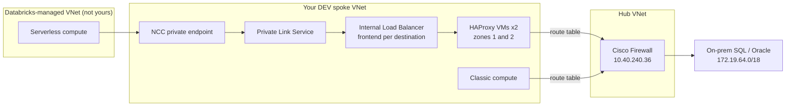
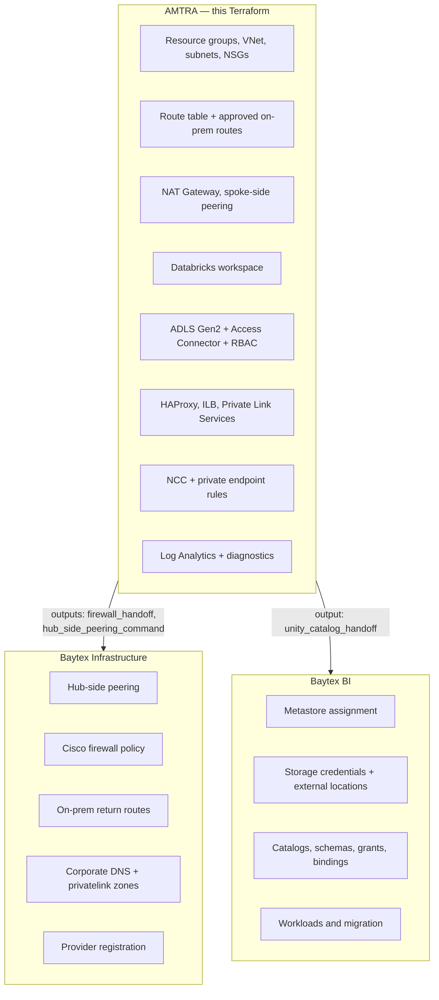

# Architecture — Why This Platform Looks The Way It Does

This document explains **what each component is for, why it exists, and how
traffic actually flows**. It is the "why" companion to
[TERRAFORM-EXPLAINED.md](TERRAFORM-EXPLAINED.md) (the "how the code works") and
[DEPLOYMENT-GUIDE.md](DEPLOYMENT-GUIDE.md) (the "how to run it").

Reference material: `Baytex Energy - Azure Network Connectivity.vsdx`
(current-state network, rev. 1, June 2026).

---

## 1. The existing estate this must fit into

The Visio current-state diagram defines the constraints. Summarised:

### 1.1 Hub — `SUB-BTE-CAN-HUB`

| Item | Value |
| --- | --- |
| Hub VNet | `vnet-bte-hub-cnc-02`, `10.40.240.0/20` |
| Firewall | Cisco Secure Firewall Virtual, HA pair (`Azure-FW01`) |
| `fwmgmt` / `fwdiag` / `fwint` / `fwext` | `10.40.240.0/28` / `.16/28` / `.32/28` / `.64/26` |
| **Firewall internal interface** | **`10.40.240.36`** |
| On-premises | QUDC02 Calgary, `172.19.64.0/18`, VPN peer `216.138.248.14` |
| Vendor VPN | Trimble, `172.23.178.197/32`, Baytex NAT'd behind `172.23.227.82` |

Everything on-premises is reached **through the Cisco firewall in the hub**.
There is no other path. That single fact drives most of this design.

### 1.2 Address plan (`10.40.0.0/16`)

| Block | Landing zone |
| --- | --- |
| `10.40.16.0/20` | Infra Prod |
| `10.40.32.0/20` | Infra Non-Prod |
| `10.40.48.0/20` | Data Prod (`vnet-bte-bi-prod-cnc-01`) |
| **`10.40.64.0/20`** | **Data Non-Prod (`vnet-bte-bi-nonprod-cnc-01`)** ← this platform belongs here |
| `10.40.80.0/20` | **OT Prod** (`vnet-bte-ot-prod-cnc-01`) |
| `10.40.96.0/20` | OT Non-Prod |
| `10.40.128.0/20` | Identity |
| `10.40.240.0/20` | Connectivity / Cisco FW hub |

### 1.3 ⚠️ The shipped example CIDRs collide with OT Production

`environments/dev/terraform.tfvars.example` proposes `vnet_cidr = 10.40.80.0/20`.
Per the diagram that block is **OT Prod**, and the collisions are exact:

| Example input | Proposed | Live OT Prod subnet | Overlap |
| --- | --- | --- | --- |
| `databricks_host_subnet_cidr` | `10.40.80.0/24` | `subnet-bte-ot-prod-cnc_mgmt` `10.40.80.0/24` | **identical** |
| `databricks_container_subnet_cidr` | `10.40.81.0/24` | `subnet-bte-ot-prod-cnc_apps` `10.40.81.0/24` | **identical** |
| `private_endpoint_subnet_cidr` | `10.40.82.0/26` | `subnet-bte-ot-prod-cnc_pep` `10.40.82.0/24` | contained |

Azure rejects peering between VNets with overlapping address space, so this
fails at apply rather than causing silent damage — but it is the wrong default
to hand a customer, and in an energy company "OT Prod" is field/SCADA territory.

**Correct source of space** is the Data Non-Prod block, `10.40.64.0/20`
(`10.40.64.0`–`10.40.79.255`). Already consumed there:

```
10.40.64.0/24    bi              10.40.66.0/24    pep
10.40.65.0/24    apps            10.40.77.0/25    dbwprivate  (existing Databricks)
                                 10.40.77.128/25  dbwpublic   (existing Databricks)
```

Leaving `10.40.67.0`–`10.40.76.255` and `10.40.78.0`–`10.40.79.255` free. A `/22`
such as `10.40.68.0/22` would fit the four subnets this platform needs with room
to grow — **subject to Baytex IPAM confirmation**, which
`docs/pre-deployment-checklist.md` already requires.

> The existing non-prod Databricks at `10.40.77.0/25` + `10.40.77.128/25` uses
> the older `dbwpublic`/`dbwprivate` naming. This build uses `dbx-host` /
> `dbx-container`, matching Databricks' current terminology for the same two
> subnets. They are the same concept, renamed.

---

## 2. The single hardest problem: serverless cannot use your route table

This is the reason the architecture is shaped the way it is. Everything in the
connectivity tier follows from it.

**Classic compute** runs on VMs inside *your* VNet. It obeys your NSGs, your
route table, and your DNS. Reaching on-premises SQL is simply:

```
classic compute → UDR (10.x on-prem prefix → VirtualAppliance 10.40.240.36) → Cisco FW → on-prem
```

**Serverless compute** (SQL warehouses, serverless jobs, Delta Live Tables) runs
in a **Microsoft/Databricks-managed VNet that you do not own**. Your route table
does not exist there. Your firewall is unreachable. Injecting a UDR changes
nothing, because the workload is not in your network at all.

The only supported way to give serverless private access to something on your
side is **Azure Private Link**, driven by a Databricks **Network Connectivity
Configuration (NCC)**. And Private Link has a hard requirement:

> A **Private Link Service** can only front a **Standard internal Load
> Balancer**, and an internal Load Balancer can only forward to backends
> **inside its own VNet**. It cannot forward to an on-premises IP address.

So Private Link alone gets serverless *into your VNet* — but not to on-premises.
Something inside the VNet must receive that traffic and relay it onward through
the firewall. That relay is the **HAProxy tier**.



Classic compute takes the short path. Serverless takes the long one. **Both end
up at the same firewall**, which is what makes the security model coherent —
there is exactly one enforcement point for on-premises access.

---

## 3. Component-by-component rationale

### 3.1 Spoke VNet and four subnets

| Subnet | Purpose | Why separate |
| --- | --- | --- |
| `dbx-host` (public) | Databricks VM host NICs | Required by Databricks VNet injection; must be delegated to `Microsoft.Databricks/workspaces` |
| `dbx-container` (private) | Databricks container NICs | Second delegated subnet, also mandatory — Databricks uses a pair |
| `private-endpoints` | Storage blob/DFS private endpoints | Needs `private_endpoint_network_policies = "Disabled"`; keeping it separate avoids that relaxation applying to workload subnets |
| `proxy` | HAProxy VMs, ILB frontends, PLS NAT IPs | Needs `private_link_service_network_policies_enabled = false`, which is a PLS-specific relaxation that must not leak elsewhere |

The two Databricks subnets are not a design choice — VNet injection requires
exactly two delegated subnets. The split of the other two **is** a choice, made
because each requires a different Azure network policy to be switched off, and
those relaxations should have the smallest possible blast radius.

### 3.2 NAT Gateway (not a default route to the firewall)

Databricks classic compute must reach the Databricks control plane, the metastore
endpoint, artifact storage, and various Azure services outbound. There were two
options:

| Option | Consequence |
| --- | --- |
| `0.0.0.0/0 → Cisco firewall` | All Databricks control-plane egress traverses the firewall. Needs firewall capacity, a large allow-list of Databricks FQDNs, and every Databricks endpoint change becomes a firewall change ticket. A missed FQDN breaks cluster start. |
| **NAT Gateway (chosen)** | Predictable SNAT with a stable egress IP, 64k ports per IP, no firewall capacity impact. **Only** the approved on-premises prefixes are routed to Cisco. |

This is why `on_prem_routes` is an explicit map of approved prefixes rather than
a default route. A `0.0.0.0/0` route to Cisco should only be introduced through a
deliberate egress-design decision with firewall capacity review.

The NAT Gateway also eliminates reliance on Azure's *default outbound access*,
which is being retired — every subnet here sets
`default_outbound_access_enabled = false` and gets egress explicitly.

**Verified:** a Databricks cluster's egress presented as `4.204.192.254`, exactly
the NAT Gateway's public IP.

### 3.3 The HAProxy tier — one frontend, one PLS, per destination

This is the least obvious part of the design, so here is the concrete reason.

Baytex's approved DEV destination list includes **three SQL Servers, all on port
1433**:

```
sqlbidb01yyc.baytexenergy.com    :1433
sqlbidb01yyc-t.baytexenergy.com  :1433
sql14yyc.baytexenergy.com        :1433
ora33yyc.baytexenergy.com        :1521
ora33yyc-t.baytexenergy.com      :1521
```

SQL/TDS and Oracle/TNS are raw TCP. There is **no SNI, no Host header, nothing to
demultiplex on**. If all three SQL servers were reached through one IP on port
1433, there would be no way to know which backend a connection was meant for.

Hence the design: **one ILB frontend IP + one Private Link Service + one HAProxy
frontend per destination**. Destination is encoded in the *IP address*, which is
the only discriminator raw TCP gives you.

```
10.40.83.11:1433 → HAProxy fe_sqlbidb01yyc   → sqlbidb01yyc.baytexenergy.com:1433
10.40.83.12:1433 → HAProxy fe_sqlbidb01yyc_t → sqlbidb01yyc-t.baytexenergy.com:1433
10.40.83.13:1433 → HAProxy fe_sql14yyc       → sql14yyc.baytexenergy.com:1433
```

That is why `on_prem_endpoints` is a **map** — adding a destination means adding
a map entry, and Terraform fans out a frontend, an LB rule, a PLS, a HAProxy
frontend/backend pair, and an NCC private endpoint rule from that one entry.

#### Why floating IP is mandatory here

Three LB rules on the same port (1433) can only coexist because each has a
distinct frontend IP **and** `floating_ip_enabled = true`. With floating IP
(Direct Server Return), Azure delivers the packet to the backend VM with the
**original destination IP intact** — so the VM sees traffic addressed to
`10.40.83.11`, `.12`, `.13` and HAProxy binds a separate frontend to each.

For that to work the VM must actually accept packets for addresses it does not
own on its NIC. That is what `configure-baytex-lb-ips.sh` does: it creates a
`dummy0` interface and binds every frontend IP to it.

> This is precisely why the CRLF defect (see DEPLOYMENT-GUIDE Appendix A) was
> fatal: that script failing meant no `dummy0`, so HAProxy could not bind, and
> the entire tier was dead while Terraform reported success.

#### Why two VMs in two zones

HAProxy is the single relay for all serverless on-premises traffic. One VM would
make it a single point of failure for every serverless workload. Two VMs in
availability zones 1 and 2, behind the same backend pool, with a TCP health probe
on port 8404, gives zone-level redundancy. The `health` frontend in
`haproxy.cfg` exists purely so the load balancer has something cheap to probe.

#### Why HAProxy is configured as code

The config is rendered by `templatefile()` from `on_prem_endpoints` and delivered
via cloud-init. Nobody SSHes in to edit it. Adding a destination is a Terraform
variable change, reviewed in a pull request, not an undocumented manual edit on
two VMs that will drift apart.

### 3.4 Private Link Service visibility — fail-closed

A PLS is discoverable by whoever knows its alias. `visibility_subscription_ids`
restricts which subscriptions may even *see* it; `auto_approval_subscription_ids`
decides whose connection requests are auto-accepted.

The module has a `precondition` that **refuses to plan** unless either an
explicit visibility list is supplied or an all-subscription exception is
deliberately enabled:

```hcl
precondition {
  condition     = var.allow_all_subscriptions_visibility || length(var.visibility_subscription_ids) > 0
  error_message = "Provide explicit visibility_subscription_ids or set allow_all_subscriptions_visibility=true as an approved exception."
}
```

A permissive default here would silently expose a path toward on-premises
databases. Making it a hard planning failure forces a conscious decision, and
records that decision in the tfvars where it can be reviewed.

### 3.5 Data foundation — ADLS Gen2, private only

| Setting | Why |
| --- | --- |
| `is_hns_enabled = true` | Hierarchical namespace = ADLS Gen2, required for Unity Catalog external locations |
| `public_network_access_enabled = false` + `network_rules.default_action = Deny` | The lake is reachable only through its private endpoints |
| `shared_access_key_enabled = false` | No account keys to leak; forces Entra ID / managed identity auth |
| `default_to_oauth_authentication = true` | Portal and tools default to Entra, not keys |
| `infrastructure_encryption_enabled = true` | Second encryption layer at rest |
| `versioning_enabled = false`, `change_feed_enabled = false` | **Not optional** — Azure forbids both on HNS accounts. Data protection comes from soft delete instead |
| `delete_retention_policy = 30d`, container 30d | The HNS-compatible protection mechanism |
| Blob **and** DFS private endpoints | Both are needed: DFS for Gen2 filesystem semantics, blob for tools/SDKs that use the blob API |

**Verified:** from a Databricks cluster, `...dfs.core.windows.net` resolved to
`10.99.82.4` and `...blob.core.windows.net` to `10.99.82.5`, with TCP 443 open on
both — i.e. compute reaches the lake privately, never over the internet.

### 3.6 Access Connector — why the platform creates it but not the catalogs

The Access Connector is an Azure resource with a system-assigned managed identity,
granted `Storage Blob Data Contributor` on the lake. It is the *bridge* between
Databricks and the storage account.

It sits on the boundary: creating it and granting it RBAC is an **Azure** action
(AMTRA's scope). Using it to create a Unity Catalog storage credential and
external locations is a **Databricks governance** action (Baytex BI's scope). So
the platform creates the connector and emits its ID in `unity_catalog_handoff`;
`baytex-bi-owned-unity-catalog-example/` shows what Baytex BI then does with it,
in a separate state.

That separation is deliberate: catalogs, grants and bindings are data-governance
decisions with a different approval path and a different change cadence than
network and platform infrastructure.

### 3.7 Workspace settings

| Setting | Value | Rationale |
| --- | --- | --- |
| `sku` | `premium` | Required for Unity Catalog, private link, and cluster policies |
| `compute_mode` | `Hybrid` | Enables both classic (VNet-injected) and serverless |
| `no_public_ip` | `true` | Secure cluster connectivity — no public IPs on cluster nodes |
| VNet injection | yes | Puts classic compute in Baytex's network so NSGs/UDRs apply |
| `public_network_access_enabled` | `true` (initially) | See below |
| `default_storage_firewall_enabled` | `true` | Locks the Databricks-managed root storage, reached via the Access Connector |
| `infrastructure_encryption_enabled` | `true` | Creation-time only; cannot be added later |
| `default_catalog.initial_type` | `UnityCatalog` | Creation-time UC enablement, prerequisite for serverless features |

**Why the front end is initially public.** This is the one deliberately permissive
setting, and it is scoped: it affects the *control plane* (UI, REST API, Power BI
connections, GitHub integration) — **not** data movement and **not** compute.
Classic compute still has no public IPs, and storage is private-only. Locking the
front end down requires private endpoints for the workspace plus a validated
private path for every user, Power BI gateway and CI runner; doing that before
those paths are designed would lock Baytex out of their own workspace. It is
tracked as an explicit exception in the pre-deployment checklist.

### 3.8 Diagnostics

Log Analytics plus diagnostic settings on the workspace, storage account, blob
service, load balancer and NAT gateway. The NAT gateway metrics matter more than
they look: SNAT port exhaustion is a classic silent failure mode for a busy
Databricks environment, and it is only visible here.

---

## 4. End-to-end flows

### Flow A — User opens the workspace

```
User browser → public workspace URL → Databricks control plane → workspace
```
Entra ID SSO. No data traverses this path; it is UI and API only.

### Flow B — Classic compute reads on-premises SQL ✅ verified

```
1. Cluster starts on VMs in dbx-host / dbx-container (no public IP)
2. Notebook resolves sqlbidb01yyc.baytexenergy.com via corporate DNS
   (VNet dns_servers → 172.19.65.x)
3. Destination 172.19.x.x matches an on_prem_routes UDR entry
4. Route table sends it to VirtualAppliance 10.40.240.36
5. Spoke→hub peering (allow_forwarded_traffic = true) carries it to the hub
6. Cisco firewall applies policy, forwards over the VPN to QUDC02
7. On-prem SQL replies; return path needs an on-prem route back to the
   DEV VNet CIDR — a Baytex-owned handoff
```

Sandbox evidence: from a cluster driver at `10.99.81.4`,
`sqlsim.sandbox.internal:1433` returned `SIMULATED-SQL-OK` through the simulated
firewall NVA.

### Flow C — Serverless reads on-premises SQL ⏳ pending NCC

```
1. Serverless SQL warehouse runs in the Databricks-managed VNet
2. Workspace is bound to the DEV NCC
3. NCC private endpoint rule for the destination targets its PLS
4. Traffic egresses via an Azure-managed private endpoint into the PLS
5. PLS delivers to its ILB frontend, e.g. 10.40.83.11:1433
6. Floating IP preserves the destination; HAProxy VM accepts it on dummy0
7. HAProxy frontend fe_sqlbidb01yyc → backend sqlbidb01yyc:1433
8. From here it is identical to Flow B, steps 3–7
```

Sandbox evidence: steps 5–8 are proven — the ILB frontends returned
`SIMULATED-SQL-OK` and `SIMULATED-ORACLE-OK` both from the HAProxy VMs and from
inside a Databricks cluster. Steps 1–4 need the NCC, which requires the
Databricks account ID.

### Flow D — Compute reads the data lake ✅ verified

```
1. Compute resolves <account>.dfs.core.windows.net
2. Private DNS zone privatelink.dfs.core.windows.net returns the private
   endpoint IP in the private-endpoints subnet
3. Traffic stays inside the VNet to the private endpoint
4. Storage firewall (default Deny, public access off) accepts it because it
   arrives via private endpoint
5. Authorisation is Entra ID — via the Access Connector's managed identity for
   Unity Catalog access; no account keys exist
```

Sandbox evidence: resolved to `10.99.82.4` / `10.99.82.5`, TCP 443 open, from a
cluster driver.

### Flow E — Compute reaches the internet / control plane ✅ verified

```
compute → no matching UDR → default route → NAT Gateway → stable public IP
```
Sandbox evidence: cluster egress observed as the NAT Gateway public IP.

### Flow F — Databricks control plane manages clusters

Outbound-initiated from the cluster (secure cluster connectivity). No inbound
public path to the nodes, which is what makes `no_public_ip` viable.

---

## 5. Why NOT the alternatives

| Alternative | Why rejected |
| --- | --- |
| Clone the existing Production Databricks setup | Current Prod carries legacy proxy VMs, permissive rules and old naming. Greenfield lets DEV adopt the new naming convention, UC-first design, and least-privilege defaults without inheriting technical debt |
| Default route `0.0.0.0/0` to Cisco | Firewall capacity and a large Databricks FQDN allow-list; a missed endpoint silently breaks cluster start (§3.2) |
| Single HAProxy VM | Single point of failure for all serverless on-premises access |
| One PLS for all destinations | Raw TCP has nothing to demultiplex on; destinations must be separated by IP (§3.3) |
| Public storage with firewall IP rules | Data would traverse public endpoints; private endpoints keep it on the Azure backbone |
| Terraform owns Unity Catalog too | Conflates infrastructure with data governance; different owners, approvals and cadence (§3.6) |
| Terraform manages both peering directions | The hub is Baytex-owned and shared. Terraform creates only the spoke side and *emits the command* for the hub side, so the hub stays under Baytex change control |

---

## 6. Ownership boundary



The Terraform outputs **are** the handoff contract.
`scripts/Export-BaytexDevHandoff.ps1` packages them as JSON so Baytex receives
exact values rather than a description of them.

---

## 7. What the sandbox rehearsal proved

The design above was not merely reviewed — it was deployed against a mock hub
containing a simulated Cisco NVA (IP forwarding + MASQUERADE) and simulated
on-premises SQL/Oracle listeners.

| Claim | Evidence |
| --- | --- |
| Spoke-side peering + hub handoff works | Peering `Connected` using the generated `hub_side_peering_command` verbatim |
| UDR → firewall → on-prem path works | `SIMULATED-SQL-OK` / `SIMULATED-ORACLE-OK` from both HAProxy VMs |
| HAProxy/ILB tier works | Both ILB frontends returned the correct backend banner |
| **Databricks classic compute reaches SQL** | Same banners returned from a cluster driver at `10.99.81.4` |
| Storage is private-only and reachable | DNS → `10.99.82.4`/`.5`, TCP 443 open from compute |
| No public IP on compute; NAT egress | Driver NICs showed only `10.99.81.4`; egress = NAT Gateway public IP |
| Multi-destination fan-out works | Two endpoints each produced their own frontend, LB rule, PLS and HAProxy frontend |

Four deployment-blocking defects were found this way, none of which `terraform
fmt`, `validate` or `plan` detected — see
[DEPLOYMENT-GUIDE.md Appendix A](DEPLOYMENT-GUIDE.md#appendix-a--fixes-applied-to-this-repository).

Not yet proven: **Flow C steps 1–4** (serverless → NCC → PLS), which requires the
Databricks account ID.

---

## 8. Applying this to TEST and PROD

The architecture is environment-independent; only inputs change. Per environment
you need a distinct subscription, a non-overlapping CIDR from the correct IPAM
block, globally-unique storage account names, its own state key, and its own
destination list. See [DEPLOYMENT-GUIDE.md Part 3](DEPLOYMENT-GUIDE.md#part-3--running-a-second-environment).

The IPAM point from §1.3 applies with force here: **TEST and PROD CIDRs must come
from their own landing-zone blocks**, not from whatever the example file happens
to contain.
