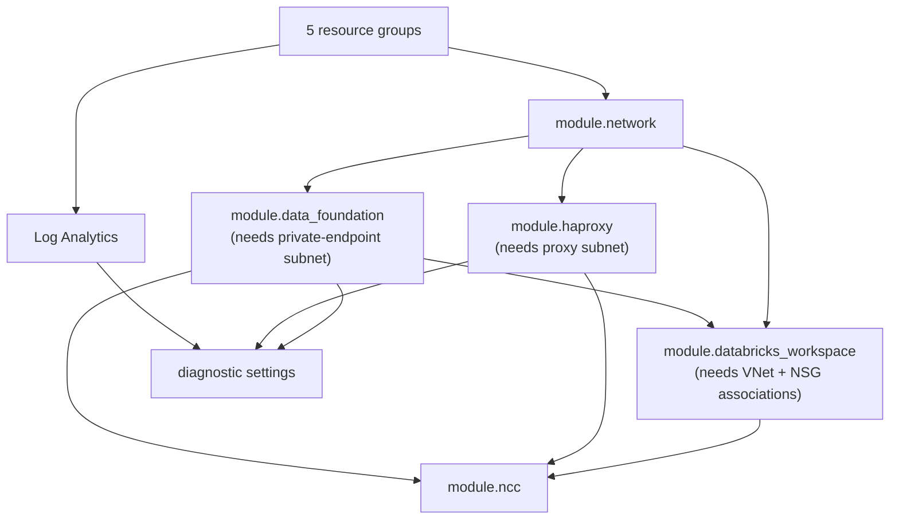

# Terraform Explained — How This Codebase Actually Works

A walkthrough of the code: how the repository is structured, how a value travels
from a `.tfvars` file to a deployed Azure resource, what each module does, the
order things get created in, and how the pipeline runs it.

Companion documents: [ARCHITECTURE.md](ARCHITECTURE.md) (why the design looks
this way) and [DEPLOYMENT-GUIDE.md](DEPLOYMENT-GUIDE.md) (how to run it).

---

## 1. Repository layout

```text
.
├── bootstrap/dev-state/                   # Root #1 — creates the state backend
├── environments/dev/                      # Root #2 — the platform (the main one)
├── modules/
│   ├── spoke-network/                     # VNet, subnets, NSGs, NAT, routes, peering
│   ├── data-foundation/                   # ADLS Gen2, Access Connector, private endpoints
│   ├── haproxy-tier/                      # HAProxy VMs, ILB, Private Link Services
│   └── ncc/                               # Databricks Network Connectivity Config
├── baytex-bi-owned-unity-catalog-example/ # Root #3 — Baytex BI's, separate state
├── scripts/                               # Operational PowerShell
└── .github/workflows/                     # Plan on PR, gated apply on main
```

### Why three separate root modules

They are separate because they have **different owners, lifecycles and state**:

| Root | Owner | Lifecycle | State |
| --- | --- | --- | --- |
| `bootstrap/dev-state` | Platform admin | Once, ever | Local |
| `environments/dev` | AMTRA | Every platform change | Azure Blob |
| `baytex-bi-owned-unity-catalog-example` | Baytex BI | Data governance cadence | Separate backend |

If Unity Catalog lived in the platform state, a routine network change would
require plan approval from the data-governance owners, and a catalog change
would risk touching networking. Separate states mean a blast radius per owner.

`bootstrap` is separate for a simpler reason: **Terraform cannot store its state
in a storage account that does not exist yet.** Bootstrap creates that account
using local state, then the platform root points its backend at it.

---

## 2. State and authentication

### 2.1 Backend

`environments/dev/backend.tf` declares an intentionally empty backend:

```hcl
terraform {
  backend "azurerm" {}
}
```

Empty because the values differ per environment. They are supplied at init time:

```powershell
terraform init -backend-config=backend.hcl
```

```hcl
# backend.hcl
resource_group_name  = "rg-bte-dbx-dev-tfstate-cnc-001"
storage_account_name = "stbtedbxdevtfcnc001"
container_name       = "tfstate"
key                  = "dev/platform.tfstate"     # <-- per environment
use_azuread_auth     = true
```

`use_azuread_auth = true` means state access is authorised by **Entra ID**, not a
storage account key. That is why `bootstrap` grants
`Storage Blob Data Contributor` to specific object IDs rather than handing out a
key — and why the state account can have `shared_access_key_enabled = false`.

One codebase serves many environments purely by changing `key` and the tfvars.

### 2.2 Providers

`environments/dev/providers.tf`:

```hcl
provider "azurerm" {
  features {}
  tenant_id                       = var.tenant_id
  subscription_id                 = var.subscription_id
  resource_provider_registrations = "none"
  storage_use_azuread             = true
}

provider "azapi"     { tenant_id = var.tenant_id, subscription_id = var.subscription_id }

provider "databricks" {
  alias      = "account"
  host       = "https://accounts.azuredatabricks.net"
  account_id = var.databricks_account_id
  auth_type  = "azure-cli"
}
```

Three points worth understanding:

1. **`subscription_id`/`tenant_id` are pinned from variables**, not inherited from
   whatever `az account show` happens to say. With Baytex production subscriptions
   visible in the same login, that pin is a meaningful safety control.
2. **`resource_provider_registrations = "none"`** — Terraform will not register
   resource providers. Registration is a subscription-wide privileged action that
   Baytex owns, so it is a documented prerequisite instead.
3. **The `databricks` provider is aliased `account`** and points at the *account*
   API, not a workspace. Only `modules/ncc` uses it. This is the provider that
   forces the two-phase apply (§6).

### 2.3 Version pinning

```hcl
required_version = ">= 1.10.0, < 2.0.0"
azurerm  = "~> 4.81.0"     # newest 4.x
azapi    = "~> 2.4"
databricks = "~> 1.128.0"
```

**azurerm cannot move to 5.x.** The AVM Databricks module v0.5.0 declares
`azurerm >= 4.12, < 5.0.0`, so raising the root constraint makes `terraform init`
unsolvable. 4.81.0 is the latest 4.x, so the repo is already as current as the
module permits. This is documented so nobody "upgrades" it and breaks the build.

---

## 3. How a value becomes a resource name

Everything flows through `environments/dev/locals.tf`. This is the mechanism that
makes one codebase serve DEV, TEST and PROD.

```hcl
# 1. Five variables compose the prefix
resource_name_prefix = "${var.organization}-${var.workload}-${var.environment}-${var.region_short}-${var.instance}"
#                        bte              dbx            dev              cnc              001
#                     => "bte-dbx-dev-cnc-001"

# 2. Every resource name derives from it
names = {
  rg_network = "rg-${var.organization}-${var.workload}-${var.environment}-network-${var.region_short}-${var.instance}"
  vnet       = "vnet-${local.resource_name_prefix}"
  workspace  = "dbw-${local.resource_name_prefix}"
  ncc        = "ncc-${local.resource_name_prefix}"
  # ...
}
```

Set `environment = "test"` and every one of ~25 resource types renames:

```
rg-bte-dbx-dev-network-cnc-001   →  rg-bte-dbx-test-network-cnc-001
vnet-bte-dbx-dev-cnc-001         →  vnet-bte-dbx-test-cnc-001
vm-bte-dbx-dev-cnc-001-proxy-01  →  vm-bte-dbx-test-cnc-001-proxy-01
```

**There are no environment literals left in the `.tf` files.** Two were found and
removed during the sandbox rehearsal — a hardcoded `computer_name = "dbxdevproxy01"`
and an action group `short_name = "dbxdev"` — either of which would have produced
`dev`-named resources inside TEST and PROD.

The action group case is instructive: Azure caps `short_name` at 12 characters,
so it cannot use the full prefix. It is derived and truncated instead:

```hcl
action_group_short_name = substr("${var.workload}${var.environment}", 0, 12)
# dbxdev / dbxtest / dbxprod
```

Tags follow the same pattern via `merge()`, so `Environment = title(var.environment)`
is applied consistently and `additional_tags` can extend without editing code.

---

## 4. The modules

### 4.1 `modules/spoke-network`

Creates the VNet, four subnets, three NSGs, NAT Gateway, route table and the
spoke side of the peering.

**Subnet delegation** — the two Databricks subnets carry the delegation that
makes VNet injection legal:

```hcl
delegation {
  name = "databricks"
  service_delegation {
    name    = "Microsoft.Databricks/workspaces"
    actions = [ "...join/action", "...prepareNetworkPolicies/action", "...unprepareNetworkPolicies/action" ]
  }
}
```

**NSG rule generation** — listener rules are generated from the endpoint list,
not hand-written:

```hcl
resource "azurerm_network_security_rule" "proxy_listener" {
  for_each               = toset(local.sorted_listener_ports)
  priority               = 200 + index(local.sorted_listener_ports, each.value)
  destination_port_range = each.value
  source_address_prefix  = var.proxy_subnet_cidr
  ...
}
```

Ports are sorted first so priorities are **deterministic**. Without the sort, map
iteration order could shuffle priorities between runs and produce spurious diffs.

**Peering** — only ever the spoke side:

```hcl
resource "azurerm_virtual_network_peering" "spoke_to_hub" {
  count                   = var.create_spoke_to_hub_peering ? 1 : 0
  allow_forwarded_traffic = true    # required: traffic transits the hub firewall
  use_remote_gateways     = false
}
```

`allow_forwarded_traffic = true` is load-bearing — return traffic from on-premises
arrives at the spoke having been *forwarded* by the firewall rather than
originating in the hub VNet, and would be dropped without it.

### 4.2 `modules/data-foundation`

Storage account, containers, Access Connector, RBAC, and two private endpoints.

Containers are created with `azapi` rather than `azurerm_storage_container`:

```hcl
resource "azapi_resource" "container" {
  for_each  = var.containers
  type      = "Microsoft.Storage/storageAccounts/blobServices/containers@2023-05-01"
  parent_id = "${azurerm_storage_account.this.id}/blobServices/default"
}
```

This uses the **ARM management plane**. The classic `azurerm_storage_container`
resource historically reached the storage *data* plane, which fails when the
account has `public_network_access_enabled = false` and the Terraform runner sits
outside the VNet — exactly this configuration. The azapi approach works because
container creation becomes an ARM call, not a call to the storage endpoint.

The `blob_properties` block carries a hard Azure constraint:

```hcl
versioning_enabled  = false   # Azure FORBIDS these on hierarchical-namespace
change_feed_enabled = false   # (ADLS Gen2) accounts. Soft delete instead.
delete_retention_policy           { days = 30 }
container_delete_retention_policy { days = 30 }
```

Setting either to `true` makes the account impossible to create. That defect was
in the original code and only surfaced at apply time.

Private DNS zone groups are conditional, so the module works with or without
central zones:

```hcl
dynamic "private_dns_zone_group" {
  for_each = length(var.blob_private_dns_zone_ids) > 0 ? [1] : []
  content { private_dns_zone_ids = var.blob_private_dns_zone_ids }
}
```

Empty list → endpoint created without a zone group, and DNS becomes a Baytex
handoff. Populated → Terraform wires the zone and DNS resolves immediately.

### 4.3 `modules/haproxy-tier`

The most intricate module. It renders configuration, builds cloud-init, and fans
out load-balancer and Private Link objects per destination.

**Template rendering, CR-stripped:**

```hcl
haproxy_config = replace(templatefile("${path.module}/templates/haproxy.cfg.tftpl", {
  dns_servers = var.dns_servers
  endpoints   = var.endpoints
}), "\r\n", "\n")
```

The `replace()` is not cosmetic. On a Windows checkout with
`core.autocrlf=true`, `templatefile()` preserves CRLF, and a script whose shebang
reads `#!/usr/bin/env bash\r` fails with
`/usr/bin/env: 'bash\r': No such file or directory`. That silently killed the
entire tier while Terraform reported success. `.gitattributes` pins these files to
LF; this `replace()` is the belt-and-braces guard.

**The fan-out.** One map entry produces five resources:

```hcl
# 1. an LB frontend
dynamic "frontend_ip_configuration" {
  for_each = var.endpoints
  content { name = "fe-${...key}", private_ip_address = ...value.frontend_ip }
}

# 2. an LB rule                     for_each = var.endpoints
# 3. a Private Link Service         for_each = var.endpoints
# 4+5. an HAProxy frontend/backend pair, rendered by the template
```

**Why `one()` in the PLS:**

```hcl
load_balancer_frontend_ip_configuration_ids = [
  one([for c in azurerm_lb.this.frontend_ip_configuration : c.id if c.name == "fe-${each.key}"])
]
```

`frontend_ip_configuration` is a set, so it cannot be indexed positionally. This
filters by name and `one()` asserts exactly one match — turning a silent
mis-wiring into a loud error.

**Fail-closed preconditions** on visibility (see ARCHITECTURE §3.4) stop a plan
rather than creating an over-exposed Private Link Service.

**cloud-init ordering.** The runcmd sequence encodes hard-won ordering:

```hcl
runcmd = [
  ["sysctl", "--system"],                                  # ip_nonlocal_bind=1
  ["systemctl", "daemon-reload"],
  ["systemctl", "enable", "--now", "baytex-lb-ips.service"],  # bind frontends to dummy0
  ["haproxy", "-c", "-f", "/etc/haproxy/haproxy.cfg"],        # validate before starting
  ["systemctl", "enable", "haproxy"],
  ["systemctl", "reset-failed", "haproxy"],                   # clear the start-rate limiter
  ["systemctl", "restart", "haproxy"],
]
```

Two defensive steps deserve explanation:

- **`ip_nonlocal_bind = 1`** lets HAProxy bind the ILB floating IPs regardless of
  whether `baytex-lb-ips.service` has run yet.
- **`reset-failed`** exists because installing the `haproxy` package starts it
  immediately — before the frontend IPs exist. Those failures exhaust systemd's
  `StartLimitBurst`, after which a plain `restart` is refused with
  `Start request repeated too quickly`, leaving the tier dead with a valid config.

**VM hardening:** SSH keys only (`disable_password_authentication = true`),
Trusted Launch (`secure_boot_enabled`, `vtpm_enabled`), platform-managed patching,
system-assigned identity, zones 1 and 2.

### 4.4 `modules/ncc`

The smallest module, and the only one using the Databricks provider:

```hcl
resource "databricks_mws_network_connectivity_config" "this" { ... }
resource "databricks_mws_ncc_binding" "workspace" { ... }            # NCC → workspace
resource "databricks_mws_ncc_private_endpoint_rule" "storage_blob" { ... }
resource "databricks_mws_ncc_private_endpoint_rule" "storage_dfs"  { ... }
resource "databricks_mws_ncc_private_endpoint_rule" "on_prem" { for_each = var.private_link_services }
```

**One NCC per environment**, because a workspace can bind to exactly one. All of
that environment's storage and on-premises rules therefore live in a single NCC.

Rules created here appear as **pending** private endpoint connections on the
target resources until approved — that is Gate 5 in the runbook, and
`scripts/Approve-BaytexDatabricksPrivateEndpoints.ps1` does it selectively, only
approving endpoints whose names match the deployment's own outputs.

### 4.5 The AVM workspace module

The workspace itself uses the Azure Verified Module rather than a hand-rolled
resource, so Baytex inherits Microsoft's maintenance of a complex resource.

```hcl
module "databricks_workspace" {
  source  = "Azure/avm-res-databricks-workspace/azurerm"
  version = "0.5.0"

  depends_on = [azurerm_resource_group.platform]
  ...
}
```

**The `depends_on` is essential.** The module contains
`data "azurerm_resource_group" "parent"` reading the group this root creates.
Because the group's *name* is statically known, Terraform would resolve that data
source during **plan** and fail with `Resource Group ... was not found` on any
first run against empty state. `depends_on` defers the module's data reads until
after the group exists.

`custom_parameters` is where VNet injection is wired:

```hcl
custom_parameters = {
  no_public_ip                                         = true
  virtual_network_id                                   = module.network.vnet_id
  public_subnet_name                                   = module.network.databricks_host_subnet_name
  private_subnet_name                                  = module.network.databricks_container_subnet_name
  public_subnet_network_security_group_association_id  = module.network.host_nsg_association_id
  private_subnet_network_security_group_association_id = module.network.container_nsg_association_id
}
```

Passing the **NSG association IDs** — not the NSG IDs — makes Terraform wait
until each association exists. Databricks rejects workspace creation if the
subnets are not fully prepared, so this ordering is functional, not cosmetic.

---

## 5. Dependency graph and apply order

Terraform derives order from references. The effective sequence:



Two edges are worth calling out:

- `data_foundation → databricks_workspace`, because
  `access_connector_id = ... ? module.data_foundation.access_connector_id : null`
  is what enables the default-storage firewall.
- `haproxy → ncc`, via `local.private_link_services_for_ncc`, which reshapes the
  HAProxy module's output into exactly what the NCC module needs:

```hcl
private_link_services_for_ncc = {
  for key, value in module.haproxy.private_link_services : key => {
    id           = value.id
    domain_names = value.domain_names
  }
}
```

The diagnostic settings use data sources that resolve **at apply**, not plan:

```hcl
data "azurerm_monitor_diagnostic_categories" "data_storage" {
  resource_id = module.data_foundation.storage_account_id   # unknown at plan
}
```

Because the ID is unknown until the storage account exists, Terraform correctly
defers the read — which also means the enabled log categories always match what
the resource actually supports, instead of a hardcoded list that rots.

---

## 6. The two-phase apply

`modules/ncc` calls the Databricks **account** API, which needs an account ID that
only exists once the tenant has a workspace. On a tenant that already has
Databricks (Baytex does) this is a non-issue. On a fresh tenant it is a
chicken-and-egg, resolved by applying in two passes:

```powershell
# Phase 1 — everything except the NCC
terraform apply -target=module.network -target=module.data_foundation `
                -target=module.haproxy -target=module.databricks_workspace ...

# Retrieve the account ID from https://accounts.azuredatabricks.net, set it in tfvars

# Phase 2 — full apply, adds the six NCC resources
terraform apply
```

`-target` pulls in dependencies automatically, so listing the top-level modules
is sufficient. Phase 2 shows `6 to add, 0 to change, 0 to destroy` — nothing from
phase 1 is disturbed.

---

## 7. Outputs — the handoff contract

Outputs are not diagnostics here; they are the **deliverable interface** between
three organisations.

```hcl
output "hub_side_peering_command" { ... }  # a runnable az command for Baytex
output "firewall_handoff"         { ... }  # source CIDRs, next hop, destination matrix
output "unity_catalog_handoff"    { ... }  # workspace, connector, storage paths for Baytex BI
output "ncc_private_endpoint_rules" { ... } # endpoint names to approve
```

`hub_side_peering_command` emits a **runnable command**, not instructions:

```hcl
output "hub_side_peering_command" {
  value = <<-EOT
  az network vnet peering create `
    --subscription ${var.hub_subscription_id} `
    --resource-group ${var.hub_resource_group_name} `
    --vnet-name ${var.hub_vnet_name} `
    --name peer-hub-to-${local.resource_name_prefix} `
    --remote-vnet ${module.network.vnet_id} `
    --allow-vnet-access `
    --allow-forwarded-traffic
  EOT
}
```

This removes transcription error from the handoff. It was executed verbatim
during the sandbox rehearsal and the peering came up `Connected` first time.

`scripts/Export-BaytexDevHandoff.ps1` packages these into JSON so Baytex receives
values, not prose.

---

## 8. Input validation

Validation is pushed as early as possible — a failed plan is far cheaper than a
failed apply, and much cheaper than a misconfiguration discovered in production.

```hcl
# Fail fast on an invalid storage account name
validation {
  condition     = can(regex("^[a-z0-9]{3,24}$", var.data_storage_account_name))
  error_message = "must be 3-24 lowercase alphanumeric characters."
}

# Exactly two proxy IPs, because the module builds exactly two nodes
validation {
  condition     = length(var.proxy_vm_private_ips) == 2
  error_message = "Exactly two HAProxy VM private IPs are required."
}

# Auto-approval must be a subset of visibility
validation {
  condition = length(setsubtract(toset(var.pls_auto_approval_subscription_ids),
                                 toset(var.pls_visibility_subscription_ids))) == 0
              || var.allow_all_subscriptions_pls_visibility
}
```

Plus `lifecycle.precondition` blocks in the HAProxy module for the security gate
that cannot be expressed as a variable rule (ARCHITECTURE §3.4).

---

## 9. CI/CD

Two workflows, deliberately asymmetric.

**`terraform-dev-plan.yml`** — runs on PRs touching `environments/dev/**` or
`modules/**`. Entra ID OIDC login (no stored secrets), `fmt -check`, `init`,
`validate`, `plan`, then uploads the rendered plan and lock file as artefacts.
Runs in the unprotected `dev-plan` environment.

**`terraform-dev-apply.yml`** — `workflow_dispatch` on `main` only, in two jobs:

1. **plan** in `dev-plan` — produces a binary `tfplan` artefact
2. **apply** in `dev` — a *protected* environment requiring approver sign-off,
   which downloads that exact artefact and applies it

The separation matters: approvers review a specific plan, and the apply executes
**that** plan rather than re-planning after approval. A re-plan could differ from
what was reviewed. The apply job also runs `git diff --exit-code` to confirm the
checkout is unmodified before applying.

Both use `id-token: write` for OIDC federation and never store an Azure secret.

> Note: the workflows are scoped to `environments/dev/**`. Adding TEST or PROD
> means adding matching path filters and matching protected GitHub Environments.

---

## 10. Running it for a new environment

Nothing in the `.tf` files changes. Per environment, supply:

| Input | Why |
| --- | --- |
| `environment` | Drives every resource name (§3) |
| `subscription_id` | Each environment is its own subscription |
| VNet + 4 subnet CIDRs | Must come from that environment's IPAM block and not overlap — see ARCHITECTURE §1.3 |
| `proxy_vm_private_ips`, `frontend_ip`, `pls_nat_ip` | Must sit inside the new proxy subnet |
| Both storage account names | Globally unique across Azure |
| `backend.hcl` → `key` | Separate state file |
| `on_prem_endpoints` | Different destinations per environment |

Verify before committing:

```powershell
terraform plan -var environment=test `
  -var data_storage_account_name=<unique> `
  -var workspace_root_storage_account_name=<unique>
```

Then scan the plan for any name still containing `dev` — there should be none.
This exact check was run during the rehearsal and confirmed all ~25 resource
types rename correctly.

---

## 11. Reading the code in a sensible order

If you are new to this repository:

1. `environments/dev/variables.tf` — the full input surface
2. `environments/dev/locals.tf` — how inputs become names
3. `environments/dev/main.tf` — how the modules wire together
4. `modules/spoke-network/main.tf` — the network foundation
5. `modules/haproxy-tier/main.tf` — the connectivity tier (read
   [ARCHITECTURE.md §3.3](ARCHITECTURE.md) first; it will not make sense otherwise)
6. `modules/data-foundation/main.tf` — the data lake
7. `modules/ncc/main.tf` — the serverless path
8. `environments/dev/outputs.tf` — the handoff contract
